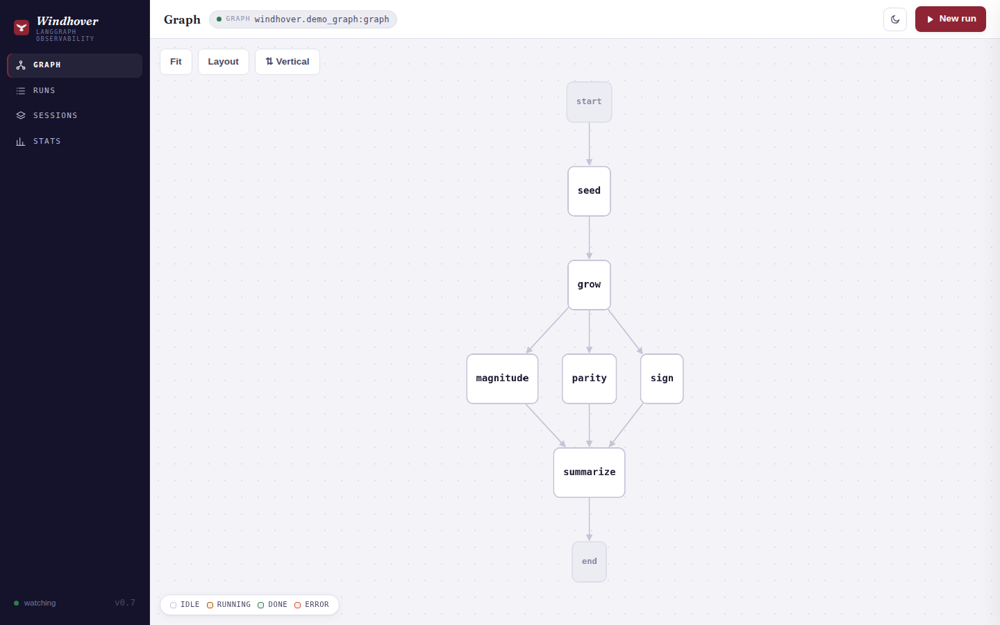
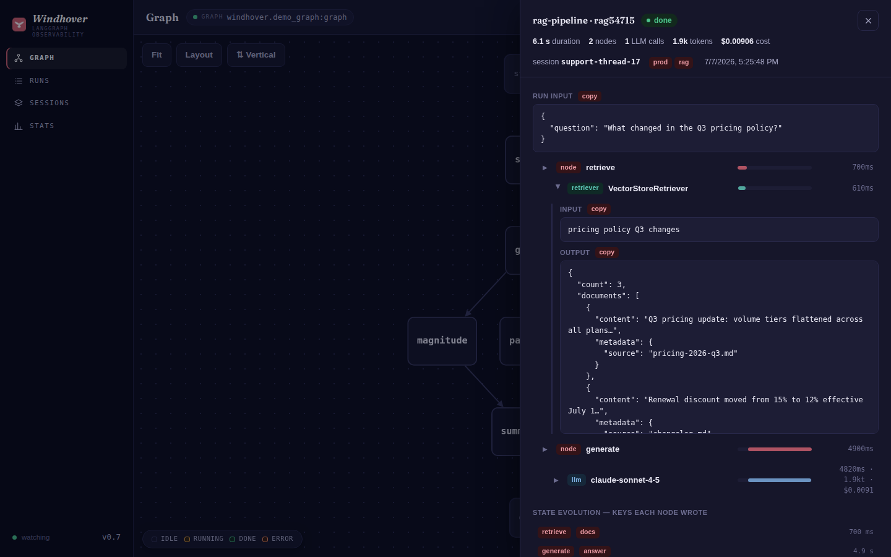
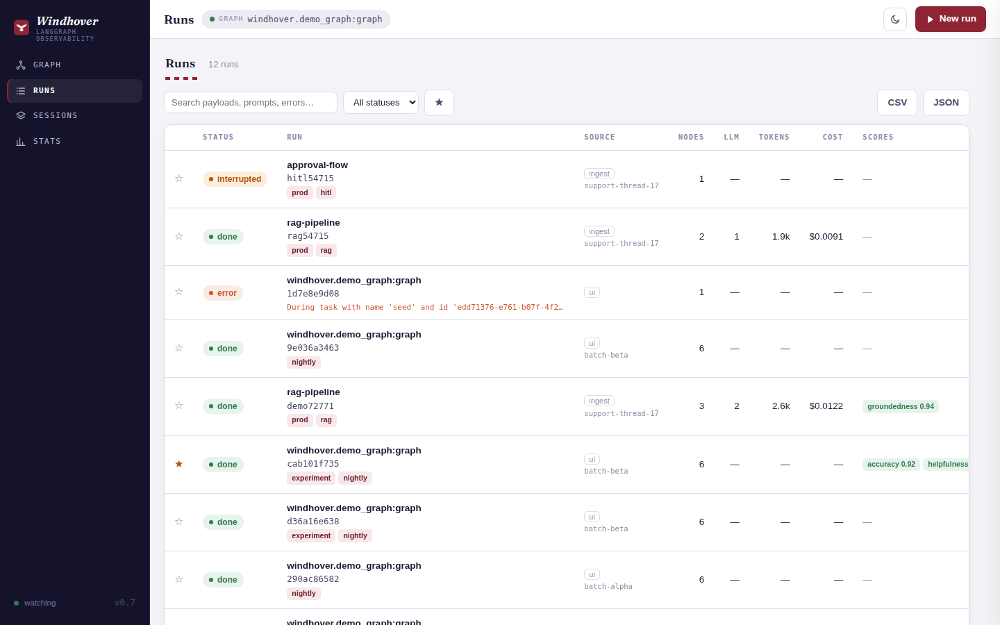
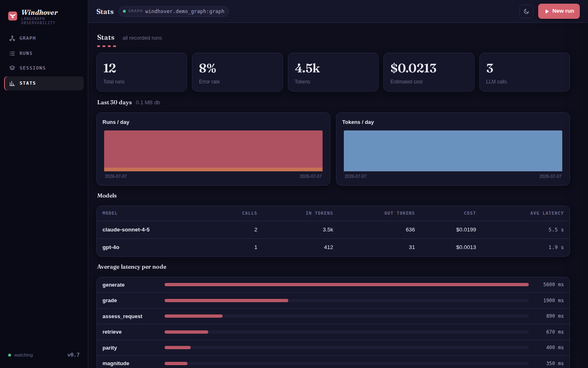

<p align="center"></p>
<h1 align="center">Windhover</h1>

> *Windhover* — the old poetic name for the kestrel, the falcon that hangs motionless
> in the wind, watching everything below. This tool does the same for your agent graphs.

**Self-hosted, mobile-friendly observability for [LangGraph](https://github.com/langchain-ai/langgraph).**
Trace depth like LangSmith (LLM prompts, tokens, cost, latency — plus retrievers and
human-in-the-loop interrupts), run history, a timing waterfall, per-node stats, error
forensics down to the throwing source line — and a **living graph view** that auto-updates
when your code's topology changes. Point it at any compiled graph, or trace runs in from
your own app. No LangSmith account, no cloud tunnel, no fragile websocket. HTTP + SSE, MIT.

> Nothing about your graph's domain is baked in. Topology, the input form, and run
> outputs all come from the graph itself. Windhover observes — it never edits your graph.

| Living graph (parallel fan-out) | Trace drawer — retrievers, LLM calls, cost, state |
|---|---|
|  |  |

| Runs — search, tags, sessions, interrupts | Dashboards — per-day, per-model |
|---|---|
|  |  |

## Quick start
```bash
pip install fastapi uvicorn langgraph
WINDHOVER_GRAPH=windhover.demo_graph:graph python -m windhover.server   # -> :8090
```
Open `http://<host>:8090`. **New run** (input pre-filled from the graph's schema) →
watch it execute → **Runs** for history, span trees, and replay → **Stats** for cost/latency.
Edit the graph file while it runs and the canvas updates itself.

Your own graph: `WINDHOVER_GRAPH="myapp.graphs:g" WINDHOVER_GRAPH_DIR=/path python -m windhover.server`

## Trace runs from any app
```python
from windhover import WindhoverTracer
graph.invoke(input, config={"callbacks": [WindhoverTracer("http://HOST:8090")]})
```
Node spans, LLM calls (model/prompt/response/tokens/cost), and tools show up in **Runs** —
wherever your app runs. Non-blocking, best-effort; never raises into your graph.

Sessions and tags use standard LangChain config — no Windhover imports needed beyond the tracer:
```python
graph.invoke(input, config={
    "callbacks": [WindhoverTracer("http://HOST:8090")],
    "metadata": {"windhover_session": "chat-42", "windhover_tags": ["prod"]},
    "tags": ["also-captured"],          # langgraph-internal tags are filtered out
})
```

## Features
- **Any graph** — topology from `graph.get_graph()`; input form from its state schema.
- **Full trace tree** — nodes → nested LLM / tool / **retriever** spans: prompts, responses,
  tokens, cost, latency, retrieved documents with their metadata.
- **Clickable graph** — tap a node for health, latency, wiring, its **source code**, and recent executions with payloads.
- **Error forensics** — failed runs show the full traceback; the failing node turns red on the
  graph, and the node's source renders with the **throwing line highlighted**.
- **Human-in-the-loop aware** — a graph paused on `interrupt()` shows an amber **interrupted**
  status plus the payload it's asking a human about.
- **State evolution** — every trace shows which state keys each node wrote, in order.
- **X-ray** — graphs with subgraphs get a canvas toggle that expands composite nodes
  (`get_graph(xray=True)`).
- **Search & filters** — full-text over prompts/payloads/errors (FTS5, LIKE fallback),
  status/tag/session filters, bookmarks, pagination, CSV/JSON export.
- **Sessions** — group runs into threads/batches; roll-up tokens, cost, errors.
- **Scores** — attach numeric evals to runs (API or UI): eval harnesses, LLM-as-judge, human review.
- **Run history + replay** — SQLite; runs persist even if the browser closes (worker thread).
- **Living graph** — file watcher re-extracts topology in a subprocess and pushes it to the UI.
- **Dashboards** — runs/tokens per day, per-model usage and latency, per-node latency, error rate.
- **Mobile-first PWA**, light/dark. Fully local (FastAPI + Cytoscape.js).

## Scores API
```bash
curl -X POST :8090/api/runs/RUN_ID/scores -H 'Content-Type: application/json' \
     -d '{"name": "accuracy", "value": 0.92, "comment": "vs golden set"}'
```

## Config (env)
`WINDHOVER_GRAPH` (module:attr; unset = ingest-only) · `WINDHOVER_GRAPH_DIR` · `WINDHOVER_DB`
· `WINDHOVER_HOST`/`WINDHOVER_PORT` (0.0.0.0/8090) · `WINDHOVER_WATCH` (1) · `WINDHOVER_PRICING`
· `WINDHOVER_RETENTION_DAYS` (0 = keep forever; else prune older runs on startup + every 6h).
Edit `windhover/pricing.json` for your models' $/1M rates (unknown model → cost null).

## Notes
Runs use the imported graph (restart to run new code); the *view* always reflects
current-on-disk topology. All frontend assets are vendored — no CDN, works fully offline.
Deep links: `#runs`, `#sessions`, `#stats`, `#run=<id>`.

## License
MIT.
